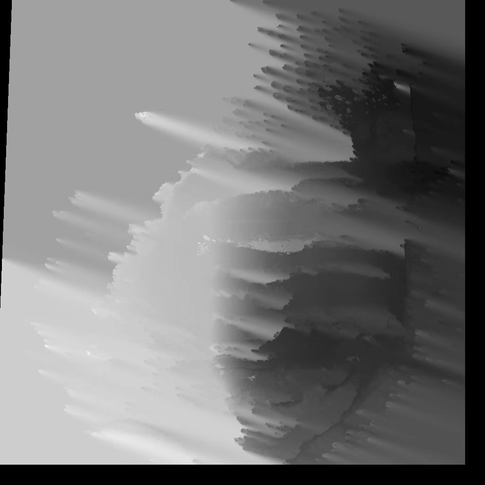
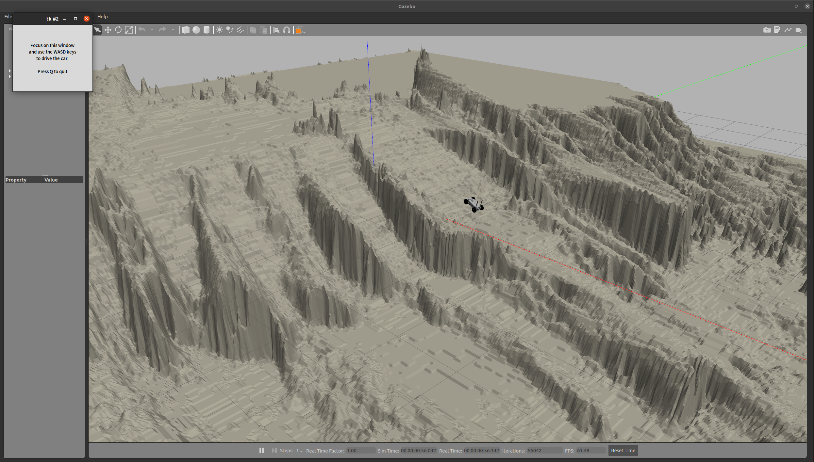

# Terrain-to-Gazebo Converter

This guide explains how to convert grayscale heightmaps into terrain files compatible with Gazebo. The purpose is to recreate realistic ground environments in the Gazebo simulation environment.

This project is a modification of the excellent open-source repository [uneven_planner](https://github.com/ZJU-FAST-Lab/uneven_planner) by ZJU-FAST-Lab. Most of the structure originates from the original repository, which focuses on planning in unstructured environments. Users are encouraged to explore the [uneven_planner](https://github.com/ZJU-FAST-Lab/uneven_planner) repository for additional insights and resources.

## Quick Start

### Step 1: Install Requirements

Install the necessary Gazebo plugins. Below is an example for ROS Noetic with Ubuntu 20.04:

```bash
sudo apt install ros-noetic-robot-state-publisher*
sudo apt install ros-noetic-joint-state-controller*
sudo apt install ros-noetic-controller*
sudo apt install ros-noetic-velocity-controllers*
sudo apt install ros-noetic-effort-controllers
sudo apt install ros-noetic-position-controllers
sudo apt install ros-noetic-gazebo-ros-control
sudo apt install ros-noetic-hector-gazebo
sudo apt install ros-noetic-effort-controllers
sudo apt install ros-noetic-joint-state-controller
sudo apt install ros-noetic-position-controllers
sudo apt install ros-noetic-velocity-controllers
sudo apt install ros-noetic-ompl
sudo apt install ros-noetic-tf2-geometry-msgs ros-noetic-ackermann-msgs ros-noetic-joy 
```

### Step 2: Build the Project

```bash
cd carsim
catkin_make
```

### Step 3: Run the Simulation

```bash
source devel/setup.bash
roslaunch carsim test.launch
```


## Modify Terrain Files

### Use Preset Terrain Models

To use a predefined terrain model:

1. Edit the `test.launch` file and set the `map_name` argument to one of the following predefined terrain models:

   ```xml
   <arg name="map_name" default="forest"/><!-- desert, forest, hill, snow, volcano -->
   ```

   Available models in [uneven_planner](https://github.com/ZJU-FAST-Lab/uneven_planner):

   - `hill`

   - `desert`

   - `volcano`

   - `forest`

### Use Custom Terrain Models

1. **Generate a Grayscale Image**

   Create a grayscale image that encodes elevation information. For example:
   
   
   
   Grayscale heightmaps can be generated by fusing multi-scan LiDAR data to create a `grid_map` with elevation information, then saving it as an image.

2. **Convert the Image to a DAE File**

   Smooth the image (via a Python script or interpolation during export) and convert it to a DAE file. A conversion tool such as [ImageToSTL](https://imagetostl.com/convert/file/png/to/dae#convert) can be used.

   

3. **Replace the Existing Model**

   Rename the exported DAE file to `real.dae` and replace the file in:

   ```
   src/carsim/models/map_real/meshes/real.dae
   ```

4. **Update the Launch File**

   Modify the `test.launch` file to use the custom model:

   ```xml
   <arg name="map_name" default="real"/>
   ```

5. **Start the Simulation**

   ```bash
   roslaunch carsim test.launch
   ```

   


注意：这里通常要对图片做平滑操作，可通过python脚本或者在导出灰度图时插值完成

PNG转DAE可以可以参考网站https://imagetostl.com/convert/file/png/to/dae#convert

- 当导出的DAE文件重命名为real.dae，替换`src/carsim/models/map_real/meshes`中的real.dae

- 修改`src/carsim/launch/test.launch` 为

  ```xml
  <arg name="map_name" default="real"/>
  ```

- 启动仿真

  ```bash
  roslaunch carsim test.launch
  ```

  


## Acknowledgements

Special thanks to the authors of [uneven_planner](https://github.com/ZJU-FAST-Lab/uneven_planner) for their excellent open-source project. If you use this repository, please also cite their corresponding paper.
